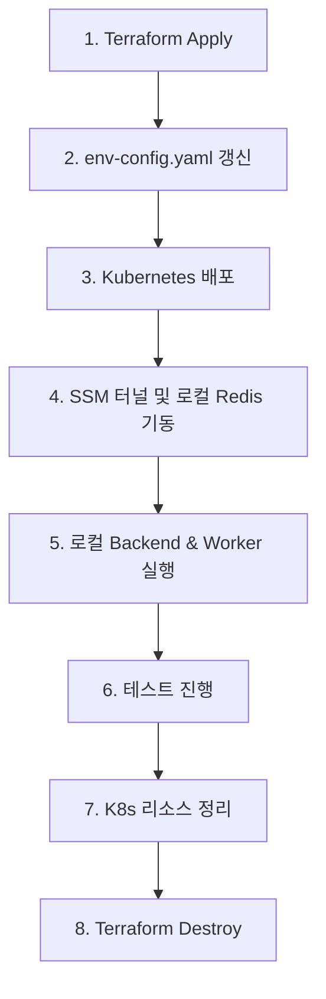

## ⚙️ 테라폼 명령어 기본 가이드

개발 환경을 구축하고 관리하기 위한 주요 테라폼 명령어 모음입니다.

```bash
# 테라폼 초기화 및 공급자(Provider) 플러그인 설치
terraform init

# 테라폼 설정 파일의 문법 및 오타 확인
terraform validate

# 인프라 변경 사항 미리보기 (계획 확인)
terraform plan

# 실제 인프라 리소스 구축 및 배포
terraform apply

# 테라폼으로 구축한 모든 인프라 리소스 삭제
terraform destroy
```

---

## 🛠️ **배포 협업 규칙**
팀 프로젝트 진행 시 코드를 동기화하고 배포하는 프로세스입니다. 아래 순서를 준수해 주세요.

```bash
# 작업 시작 전, 원격 저장소의 최신 변경 사항을 먼저 반영합니다.
git pull origin main

# 작업 내용 커밋하기
# 커밋 메시지는 이름(영문): 본인이 작업한 내용 작성 형식으로 통일합니다.
git commit -m "hjin: 인프라 기초 작업 완료"

# 원격 저장소에 푸시 후 공유
git push origin main

# 푸시가 완료되면 반드시 팀 톡방에 알림을 남겨주세요!
```

---

## 🚀 AWS EKS & 로컬 백엔드 연동 수동 실행 런북 (Developer Runbook)

개발자가 로컬 PC에서 AWS 인프라(Terraform)를 직접 띄우고, 쿠버네티스 리소스를 배포하며, 로컬 백엔드와 연동하여 테스트 및 최종 정리(Destroy)까지 직접 제어하며 수행할 수 있는 Runbook 가이드라인입니다.



### 1단계: AWS 인프라 배포 (Terraform)
개발망(`dev`) 폴더로 이동하여 인프라를 프로비저닝합니다. (약 15~20분 소요)

> [!IMPORTANT]
> 처음부터 인프라를 새로 띄울 때는 EKS 클러스터가 존재하지 않는 상태에서 Helm 프로바이더(ALB Controller)가 먼저 API 서버 연결을 맺으려고 시도하여 `dial tcp` 연결 에러가 발생해 멈춥니다.
> 이를 방지하기 위해 아래와 같이 **1차로 EKS 클러스터를 타겟팅 배포하고, 2차로 전체 배포**를 수행해야 안전하게 성공합니다.

```powershell
# 1. 테라폼 개발 환경 폴더로 이동
cd ../Train_repo/environments/dev

# 2. AWS 타겟 계정 프로필 환경변수 설정 (필수)
$env:AWS_PROFILE="team"

# 3. 테라폼 초기화
terraform init

# 4. [1차 배포] 네트워크 및 EKS 클러스터 우선 생성 (약 10~15분 소요)
terraform apply -target=module.networking -target=module.logging -target=module.eks-cluster -auto-approve

# 5. [2차 배포] 나머지 DB, ALB Controller, Cognito 등 잔여 자원 일괄 배포 완료 (약 3~5분 소요)
terraform apply -auto-approve
```

### 2단계: 쿠버네티스 환경변수 설정 (`env-config.yaml`)
테라폼 배포가 완료되면 출력된 아웃풋 정보(혹은 AWS 콘솔)를 참고하여 쿠버네티스 ConfigMap 환경변수를 최신 엔드포인트 주소로 업데이트합니다.

*   **수정할 파일 경로:** `../Train_repo/modules/infra/k8s-manifests/env-config.yaml`

```yaml
data:   
  AWS_REGION: "ap-northeast-2"
  
  # 1. 테라폼 결과로 나온 SQS Queue URL 입력
  SQS_QUEUE_URL: "https://sqs.ap-northeast-2.amazonaws.com/009152047332/reservation-queue"

  # 2. 테라폼 결과로 나온 Aurora MySQL Cluster endpoint 주소 입력
  DB_HOST: "trail-aurora-cluster.cluster-xxxx.ap-northeast-2.rds.amazonaws.com"
  DB_PORT: "3306"
  DB_NAME: "trail_db"

  # 3. 테라폼 결과로 나온 ElastiCache Redis primary configuration endpoint 주소 입력
  REDIS_HOST: "clustercfg.trail-redis-cluster.xxxx.apn2.cache.amazonaws.com"
  REDIS_PORT: "6379"
```

### 3단계: Kubernetes 리소스 배포 (EKS)
수정한 매니페스트 파일들을 EKS 클러스터 내에 배포합니다.

> [!IMPORTANT]
> 클러스터 내부에 ESO(External Secrets Operator)가 설치되어 있지 않은 경우, 백엔드/워커 파드가 의존하고 있는 `train-secret` 이라는 이름의 Secret을 찾을 수 없어 **`CreateContainerConfigError`** 오류와 함께 실행이 불가능해집니다.
> 이를 방지하기 위해 매니페스트를 배포하기 전에 아래 **임시 Secret 수동 생성 명령어(3번)**를 반드시 한 번 실행해 주어야 안전하게 기동됩니다.

```powershell
# 1. EKS 매니페스트 폴더로 이동
cd ../Train_repo/modules/infra/k8s-manifests

# 2. AWS EKS kubeconfig 갱신 (클러스터 인증 연동)
$env:AWS_PROFILE="team"
aws eks update-kubeconfig --name team-train-20260611-dev-eks --region ap-northeast-2

# 3. [에러 방지] 임시 비밀번호용 Secret 수동 생성 (ESO가 없을 때 필수)
kubectl create secret generic train-secret --from-literal=DB_PASSWORD="Password123!" --from-literal=DB_USER="admin" --dry-run=client -o yaml | kubectl apply -f -

# 4. 매니페스트 일괄 배포
kubectl apply -f .
```

### 4단계: 로컬 연동 테스트 환경 기동
로컬 PC에서 데이터베이스 접근 및 Redis 캐시를 돌리기 위해 세션을 수동으로 엽니다.

> 💡 **연동 아키텍처 안내:**
> * **RDS DB:** 보안상 프라이빗 망에 존재하므로, 로컬 직접 접속 대신 AWS에 배포된 진짜 RDS DB를 포트포워딩(터널링)을 통해 연결해 사용합니다.
> * **Redis:** 이중 터널링으로 인한 로컬 개발 피로도를 낮추기 위해, 로컬 PC에 standalone Redis를 가볍게 띄워 테스트 편의성을 확보합니다.

#### ① RDS MySQL 포트 포워딩 터널 열기 (터미널 1)
AWS SSM Session Manager를 통해 로컬의 3306 포트를 원격 RDS와 터널링합니다.
```powershell
# 터미널 1을 열고 아래 실행 (테스트하는 동안 계속 켜두어야 함)
$env:AWS_PROFILE="team"
$env:Path += ";C:\Program Files\Amazon\SessionManagerPlugin\bin"
aws ssm start-session --target i-0f61ca719d678c627 --document-name AWS-StartPortForwardingSessionToRemoteHost --region ap-northeast-2 --parameters --% "{"host":["trail-aurora-cluster.cluster-xxxx.ap-northeast-2.rds.amazonaws.com"],"portNumber":["3306"],"localPortNumber":["3306"]}"
```
*(주의: 파라미터 내 `host` 값은 2단계에서 얻은 실제 Aurora Cluster Endpoint 주소로 교체해야 합니다.)*

#### ② 로컬 standalone Redis 기동 (터미널 2)
로컬 독립 실행형 Redis를 실행하여 백엔드 캐시 소켓을 받아 줍니다.
```powershell
# 터미널 2을 열고 Backend_Train 폴더로 이동하여 실행
cd ../Backend_Train
.\redis-bin\redis-server.exe --bind 127.0.0.1
```

---

### 5단계: 로컬 백엔드 API 및 워커 실행

#### ① 백엔드 API 서버 기동 (터미널 3)
```powershell
cd ../Backend_Train
$env:AWS_PROFILE="team"
npm run app
```

#### ② SQS 폴링 워커 기동 (터미널 4)
```powershell
cd ../Backend_Train
$env:AWS_PROFILE="team"
npm run worker
```

---

### 6단계: 테스트 진행
*   **열차 잔여석 조회 (GET):**
    ```bash
    curl.exe "http://localhost:8080/api/trains/1?start=SEOUL&end=BUSAN"
    ```
*   **예매 요청 (POST):**
    ```powershell
    # Node.js fetch를 사용해 쉘 따옴표 오류를 우회하여 요청
    node -e "fetch('http://localhost:8080/api/reserve', {method:'POST', headers:{'Content-Type':'application/json'}, body:JSON.stringify({userId:1, trainId:1, startStation:'SEOUL', endStation:'BUSAN'})}).then(r => r.json()).then(console.log).catch(console.error)"
    ```

---

### 7단계: 작업 완료 후 인프라 정리 (중요 - 과금 방지)

#### ① Kubernetes 리소스 선제 삭제 (터미널에서 먼저 실행)
ALB 및 로드밸런서 타겟 그룹이 EKS 내부에서 정상 해제될 시간을 보장하기 위해 선제적으로 매니페스트를 삭제합니다.
```powershell
cd ../Train_repo/modules/infra/k8s-manifests
$env:AWS_PROFILE="team"
kubectl delete -f . --ignore-not-found
```
*(삭제 로그 완료 및 AWS 로드밸런서 콘솔에서 ALB가 사라진 것을 확인한 후 테라폼 삭제로 넘어가는 것이 안전합니다.)*

#### ② 테라폼 인프라 파기 (Destroy)
```powershell
cd ../Train_repo/environments/dev
$env:AWS_PROFILE="team"
terraform destroy -auto-approve
```
